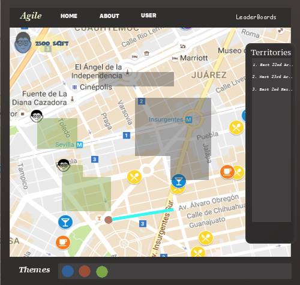

# Agile: Run For Your Kingdom
## Requirements and Specification Document (02/01/2018)

 

#### Meetings and Project Abstract

Our project and web application is called Agile, quite fittingly, as we will explain. We also consider our team, The Tommy Bahamas, quite agile. We quickly determined that meeting briefly after each class would be effective, like a scrum (though under the circumstances not as frequent as scrum). During the first class, we agreed to each come up with proposals that we would review during our first meeting (after the second class). At this initial meeting, we discussed four ideas including a time tracker for tourists, a post-requisite courses finder for SFU students, an interactive gift card center and an employer reference site. We discussed and evaluated each for API applicability as well as usefulness, creativity and ease of use and development.

While we could have stuck with one of those ideas, we decided to be agile and take another week to brainstorm before choosing a project. This left us only a week to prepare our project proposal for the customer, so we divided up the proposal writing and editing to prepare this specific document. More agility was recognized as we were successful at building on previous ideas while also being able to let the original ones go. Finally, even with missing one of our teammates during the project selection meeting, we were able to collectively choose a project using in-person and online communication.

Using collaboration tools such as Slack and Google Drive we could share information and communicate effectively during the selection process. We shared other ideas such as a Rally Racer application that included posting photos at checkpoints and competing with friends and the public. We also considered further how a post-requisite finder could be implemented, if it was feasible to implement with the time given, and if it solved the problem better than anything currently on the market. Ultimately, the application we selected creates virtual tracks of your actual outdoor running circuits and turns them into real graphical territories based on geolocation positioning. It was spun from different online .io games such as slither.io or paper.io, and focuses on using the Google Maps API.

More specifically, our Agile application is based on capturing territories represented as squares by running or jogging around in a circuit. To make the game more competitive, the user will be ranked according to how frequently they captured the territory as well as how much total territory they have accumulated and this data will be represented in leaderboards that is visible to all users. Additionally, users will also be able to invade captured territories by running around a larger circuit that includes the captured area, or capture parts of territories by enclosing a part of someone else’s territory in their own new area.

Along the way we came up with many features to think about in future iterations including making popular areas difficult to capture or invade, teaming up with other users to capture a territory will make it harder for other users to invade, and also viewing fitness stats based on all the exercise the user has done. Other “epics” may come from the use of other APIs (in addition to Google Maps) that we are considering to incorporate in Agile such as Google Fit REST API.
The Problem and Our Solution

#### The Problem and Our Solution

The problem is somewhat similarly solved by a few apps where the runner is provided some sort of motivation to run, for example, the sound of zombies or dogs chasing you while you run. Like the PokémonGo game that gained lots of popularity among people of all ages by encouraging them to go outside in hopes of catching Pokémon, our game follows a similar ideology. Agile is mostly focused on getting people outside to run or walk in order to capture territories in contrast to the pokemon game which involved standing at a Pokéstop in order to catch valuable pokémon. Although PokémonGo inspired people to go outside, the main purpose of our game is to make people do physical activity while having fun.  Whether you are on your morning jog, or trying to get motivated to go for a run, our game provides a goal to work toward. In addition, since ranked games and competing against other people on a live platform are very popular these days, Agile will follow a similar pattern by having a live leaderboard and displaying peoples territories near you.

This application makes living a healthier life easier by encouraging people to go outside with incentive to compete against other users and become “king of the world” by capturing the most territories. It provides the thrill of an online multiplayer game, but through real-life adventures. Hence, maintaining an active and healthy lifestyle for the users. This contributes towards the fitness of our society as well as nurturing a healthy community environment and thus is an investment that benefits every user.

 

**Audience**

Our main target audience is people who do not currently run, a portion of whom could enjoy playing web games already. Our goal is to provide people with motivation who are hoping to start exercising but need that extra push to get going. In addition, people who already run or walk regularly will enjoy the extra motivation and challenge our app can provide them during their daily exercise.

**Scope**

There is one main feature which involves capturing territories on a map while running or walking. However we plan on adding many sub features  as mentioned in our abstract such as a territorial ranking system, group/team territories, and being able to eliminate other players while they are in the process of capturing a territory. We also considered how this could become difficult in very crowded or popular area; our solution involved repeating your circuit around the desired area multiple times to capture it to make it more difficult and time consuming. We believe that because the main feature implementation will be demanding, only adding smaller features to accentuate it will make this project feasible for five team members to complete in the time we are given.

**Sample Stories and Scenarios**

I want to be the king of my local territory, so I run around the same area frequently with the web app open on my mobile device that tracks my geographical path. Then I go home and check on the web page (on a phone or computer) to see how I ranked and see who else is competing with me in the same area.
I have been using the web app for awhile now and I log into my account to check my local ranking. I see that I have dropped significantly and feel motivated to go for a run this evening to try and work my way back up the leaderboard.
Members may move to a new neighborhood and want to make new friends or find a new running partner. They could look in the app and see where other members regularly run to get an idea of popular running routes.
Other things I can do are
Customize a territory if I own it with images or icons.
Take over somebody else’s territory, fully or partially.
Join forces with other people to make a team territory which is harder for others to capture from us. 	

**UI MockUp**

